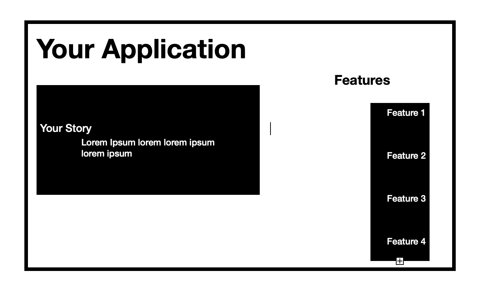

#  My Application
this is a short description of what my app does
 

 

### Table of Contents
- [Installation](#installation-instructions)
- [Usage](#how-to-use)
- [License](#license)
- [Contributing](#how-to-contribute)
- [Tests](#tests)

 

 

## Installation Instructions
Follow the download instructions on our webpage
 

## How to Use
Follow the 'getting started' directions to use My Application
 

## License
MIT
 

## How to Contribute

 

## Tests

## Questions
[Link to GitHub](https://github.com/gitUserName)
    
Contact me via email:
    mymail@gmail.com 

     